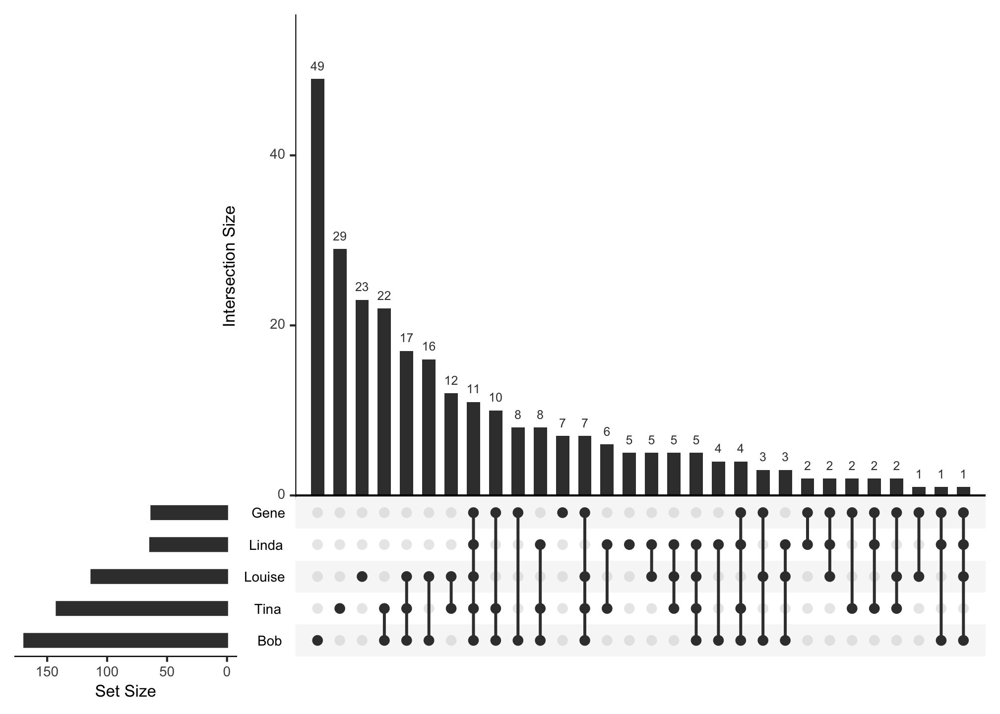

📺 OK, not _really_! 

This is actually about `tidyr::pivot_*()` functions, which you can learn all
about in the new tidyr version 1.0.0 [Pivoting
vignette](https://tidyr.tidyverse.org/articles/pivot.html)! 

But, I *will* be using some nifty TV-related data. So, I'm sticking
with the name.


```r
library(tidyverse)
```


## 🍔 Bob's Burgers: A Belcher Family survey


```r
sheet <- googlesheets::gs_title("bobs_burgers_survey_results")

bobs_ws <- googlesheets::gs_ws_ls(sheet)
```


```r
raw_dat <- sheet %>% 
  googlesheets::gs_read(ws = glue::glue("{bobs_ws}"))
```

```
## Accessing worksheet titled 'Form Responses 1'.
```

```
## Parsed with column specification:
## cols(
##   Timestamp = col_character(),
##   `Members of the Belcher family with whom I identify (select all that apply)` = col_character()
## )
```


```r
belcher_results <- tibble::rowid_to_column(raw_dat, "resp_id") %>%
  dplyr::rename("response" = `Members of the Belcher family with whom I identify (select all that apply)`) %>%
  dplyr::select(-Timestamp)
```

Because I used a [Google Form](https://docs.google.com/forms/d/e/1FAIpQLScYLAkzDzEOWvXrn601Vt79S6DsKLkv12NUsqbo72j1fmapWA/viewform) to collect this data, I don't have to worry about
order of names, since they come out the same every time.


```r
agg_results <- belcher_results %>%
  dplyr::group_by(response) %>%
  dplyr::summarise(total = n()) %>%
  dplyr::arrange(desc(total))

agg_results
```

```
## # A tibble: 30 x 2
##    response                       total
##    <chr>                          <int>
##  1 Bob                               49
##  2 Tina                              29
##  3 Louise                            23
##  4 Bob, Tina                         22
##  5 Bob, Tina, Louise                 17
##  6 Bob, Louise                       16
##  7 Tina, Louise                      12
##  8 Bob, Linda, Tina, Gene, Louise    11
##  9 Bob, Tina, Gene                   10
## 10 Bob, Gene                          8
## # … with 20 more rows
```

### `tidyr::separate_rows()`

Let's make them long with
[`tidyr::separate_rows()`](https://tidyr.tidyverse.org/dev/reference/separate_rows.html).
I'm also adding a numeric variable, `identify` (short for "character(s) with
whom I identify"), and ensuring that respondent IDs don't get erroneously
treated as numeric, by converting them to characters.


```r
belcher_results <- belcher_results %>%
  tidyr::separate_rows(response) %>%
  dplyr::mutate(identify = 1,
                resp_id = as.character(resp_id))

head(belcher_results)
```

```
## # A tibble: 6 x 3
##   resp_id response identify
##   <chr>   <chr>       <dbl>
## 1 1       Linda           1
## 2 1       Tina            1
## 3 1       Louise          1
## 4 2       Bob             1
## 5 2       Gene            1
## 6 3       Bob             1
```


### `tidyr::pivot_wider()`

Now we'll take one of the "new" tidyr verbs for a spin, [`pivot_wider()`](https://tidyr.tidyverse.org/dev/reference/pivot_wider.html). 
Rather than fill things out with a bunch of `NA`s, we'll prepare our data 
to use with the `UpSetR` package by turning it into binaries, and ditch the 
respondent ID in the end.


```r
binary_tib <- belcher_results %>%
  tidyr::pivot_wider(
    names_from = response,
    values_from = identify,
    values_fill = list(identify = 0)
  ) %>%
  dplyr::select(-resp_id)

head(binary_tib)
```

```
## # A tibble: 6 x 5
##   Linda  Tina Louise   Bob  Gene
##   <dbl> <dbl>  <dbl> <dbl> <dbl>
## 1     1     1      1     0     0
## 2     0     0      0     1     1
## 3     0     1      0     1     1
## 4     1     1      1     1     1
## 5     0     0      0     1     0
## 6     0     0      1     0     0
```

### `UpSetR::upset()`

I *highly* recommend Paul Campbell's
[code-through](https://www.cultureofinsight.com/blog/2018/01/25/2018-01-25-visualising-twitter-follower-overlap/)
using [UpSetR](https://github.com/hms-dbmi/UpSetR), which gave me (among other things) the pro tip that `upset()` does
*not* like tibbles (hence the `as.data.frame()` at the end).


```r
binary_df <- as.data.frame(binary_tib)
```


```r
UpSetR::upset(binary_df, nsets = 5, order.by = "freq")
```



## 🎦 I have seen this movie...

Let's take a look at another dataset I collected with a quick survey, this one asking people whether they had or had not seen a given movie.


```r
sheet <- googlesheets::gs_title("seen_this_movie")
```

```
## Sheet successfully identified: "seen_this_movie"
```

```r
movie_ws <- googlesheets::gs_ws_ls(sheet)

raw_dat <- sheet %>% 
  googlesheets::gs_read(ws = glue::glue("{movie_ws}"))
```

```
## Accessing worksheet titled 'Form Responses 1'.
```

```
## Parsed with column specification:
## cols(
##   Timestamp = col_character(),
##   `Airplane!` = col_logical(),
##   Anchorman = col_logical(),
##   `Animal House` = col_logical(),
##   `The Big Lebowski` = col_logical(),
##   `The Blues Brothers` = col_logical(),
##   Borat = col_logical(),
##   Bridesmaids = col_logical(),
##   `Office Space` = col_logical(),
##   `Old School` = col_logical(),
##   `This Is Spinal Tap` = col_logical(),
##   `Tommy Boy` = col_logical(),
##   Superbad = col_logical(),
##   `My age is…` = col_double()
## )
```

First I'll use [`tibble::rowid_to_column()`](https://tibble.tidyverse.org/reference/rownames.html) to keep track of which user said what (and, again, make sure those are stored as characters rather than numeric, so I don't accidentally analyze it the wrong way).

I still don't care about the timestamp, so I'll get everything _but_ that using `dplyr::select(-Timestamp)`.

The variable names here have a whole bunch of annoying characters (e.g. spaces, exclamation points). So, I'm going to use Sam Firke's [janitor](https://sfirke.github.io/janitor/) package — specifically the  [`janitor::clean_names()`](https://sfirke.github.io/janitor/reference/clean_names.html) function — to take care of some of the grunt work for me there.


```r
movie_results <- tibble::rowid_to_column(raw_dat, "resp_id") %>%
  dplyr::mutate(resp_id = as.character(resp_id)) %>%
  dplyr::select(-Timestamp) %>%
  janitor::clean_names()

head(movie_results)
```

```
## # A tibble: 6 x 14
##   resp_id airplane anchorman animal_house the_big_lebowski the_blues_broth…
##   <chr>   <lgl>    <lgl>     <lgl>        <lgl>            <lgl>           
## 1 1       TRUE     TRUE      TRUE         FALSE            TRUE            
## 2 2       FALSE    TRUE      TRUE         TRUE             FALSE           
## 3 3       FALSE    FALSE     FALSE        TRUE             FALSE           
## 4 4       FALSE    FALSE     FALSE        FALSE            FALSE           
## 5 5       FALSE    TRUE      FALSE        FALSE            FALSE           
## 6 6       FALSE    TRUE      FALSE        TRUE             TRUE            
## # … with 8 more variables: borat <lgl>, bridesmaids <lgl>,
## #   office_space <lgl>, old_school <lgl>, this_is_spinal_tap <lgl>,
## #   tommy_boy <lgl>, superbad <lgl>, my_age_is <dbl>
```

Since this dataset is wide, let's also take a gander at it using `glimpse()`:


```r
glimpse(movie_results)
```

```
## Observations: 142
## Variables: 14
## $ resp_id            <chr> "1", "2", "3", "4", "5", "6", "7", "8", "9", …
## $ airplane           <lgl> TRUE, FALSE, FALSE, FALSE, FALSE, FALSE, TRUE…
## $ anchorman          <lgl> TRUE, TRUE, FALSE, FALSE, TRUE, TRUE, TRUE, F…
## $ animal_house       <lgl> TRUE, TRUE, FALSE, FALSE, FALSE, FALSE, FALSE…
## $ the_big_lebowski   <lgl> FALSE, TRUE, TRUE, FALSE, FALSE, TRUE, TRUE, …
## $ the_blues_brothers <lgl> TRUE, FALSE, FALSE, FALSE, FALSE, TRUE, FALSE…
## $ borat              <lgl> FALSE, FALSE, TRUE, FALSE, FALSE, TRUE, FALSE…
## $ bridesmaids        <lgl> TRUE, TRUE, FALSE, FALSE, TRUE, FALSE, FALSE,…
## $ office_space       <lgl> FALSE, TRUE, FALSE, FALSE, FALSE, FALSE, FALS…
## $ old_school         <lgl> FALSE, TRUE, FALSE, FALSE, FALSE, FALSE, FALS…
## $ this_is_spinal_tap <lgl> FALSE, FALSE, FALSE, FALSE, FALSE, TRUE, FALS…
## $ tommy_boy          <lgl> FALSE, FALSE, FALSE, FALSE, FALSE, FALSE, FAL…
## $ superbad           <lgl> TRUE, TRUE, FALSE, FALSE, FALSE, TRUE, TRUE, …
## $ my_age_is          <dbl> 48, 31, 30, 20, 29, 28, 24, 42, 33, 34, 33, 3…
```


---
<!--

```r
devtools::session_info()
```

```
## ─ Session info ──────────────────────────────────────────────────────────
##  setting  value                       
##  version  R version 3.6.1 (2019-07-05)
##  os       macOS Mojave 10.14.6        
##  system   x86_64, darwin15.6.0        
##  ui       X11                         
##  language (EN)                        
##  collate  en_US.UTF-8                 
##  ctype    en_US.UTF-8                 
##  tz       America/New_York            
##  date     2019-09-18                  
## 
## ─ Packages ──────────────────────────────────────────────────────────────
##  package      * version    date       lib
##  askpass        1.1        2019-01-13 [1]
##  assertthat     0.2.1      2019-03-21 [1]
##  backports      1.1.4      2019-04-10 [1]
##  broom          0.5.2      2019-04-07 [1]
##  callr          3.3.1      2019-07-18 [1]
##  cellranger     1.1.0      2016-07-27 [1]
##  cli            1.1.0      2019-03-19 [1]
##  colorspace     1.4-1      2019-03-18 [1]
##  crayon         1.3.4      2019-08-02 [1]
##  curl           4.1        2019-09-16 [1]
##  DBI            1.0.0      2018-05-02 [1]
##  dbplyr         1.4.2      2019-06-17 [1]
##  desc           1.2.0      2019-08-02 [1]
##  devtools       2.2.0.9000 2019-09-13 [1]
##  digest         0.6.20     2019-07-04 [1]
##  dplyr        * 0.8.3.9000 2019-09-12 [1]
##  DT             0.9        2019-09-17 [1]
##  ellipsis       0.2.0.9000 2019-09-12 [1]
##  emo            0.0.0.9000 2019-08-02 [1]
##  evaluate       0.14       2019-05-28 [1]
##  fansi          0.4.0      2019-08-02 [1]
##  forcats      * 0.4.0.9000 2019-08-20 [1]
##  fs             1.3.1.9000 2019-09-13 [1]
##  generics       0.0.2      2018-11-29 [1]
##  ggplot2      * 3.2.1.9000 2019-09-09 [1]
##  glue           1.3.1.9000 2019-09-12 [1]
##  googlesheets   0.3.0      2018-06-29 [1]
##  gridExtra      2.3        2017-09-09 [1]
##  gtable         0.3.0      2019-03-25 [1]
##  haven          2.1.1      2019-07-04 [1]
##  hms            0.5.1      2019-08-23 [1]
##  htmltools      0.3.6      2017-04-28 [1]
##  htmlwidgets    1.3        2018-09-30 [1]
##  httr           1.4.1      2019-08-05 [1]
##  janitor        1.2.0      2019-04-21 [1]
##  jsonlite       1.6        2018-12-07 [1]
##  knitr          1.24       2019-08-08 [1]
##  labeling       0.3        2014-08-23 [1]
##  lattice        0.20-38    2018-11-04 [1]
##  lifecycle      0.1.0      2019-08-01 [1]
##  lubridate      1.7.4.9000 2019-09-13 [1]
##  magrittr       1.5        2014-11-22 [1]
##  memoise        1.1.0      2017-04-21 [1]
##  modelr         0.1.5      2019-08-08 [1]
##  munsell        0.5.0      2018-06-12 [1]
##  nlme           3.1-141    2019-08-01 [1]
##  openssl        1.4.1.9000 2019-09-13 [1]
##  pillar         1.4.2      2019-06-29 [1]
##  pkgbuild       1.0.5      2019-08-26 [1]
##  pkgconfig      2.0.2      2018-08-16 [1]
##  pkgload        1.0.2      2018-10-29 [1]
##  plyr           1.8.4      2016-06-08 [1]
##  prettyunits    1.0.2      2015-07-13 [1]
##  processx       3.4.1.9000 2019-08-02 [1]
##  ps             1.3.0      2018-12-21 [1]
##  purrr        * 0.3.2.9000 2019-08-14 [1]
##  R6             2.4.0      2019-02-14 [1]
##  Rcpp           1.0.2      2019-07-25 [1]
##  readr        * 1.3.1      2018-12-21 [1]
##  readxl         1.3.1      2019-03-13 [1]
##  remotes        2.1.0      2019-06-24 [1]
##  reprex         0.3.0      2019-05-16 [1]
##  rlang          0.4.0.9002 2019-09-17 [1]
##  rmarkdown      1.15       2019-08-21 [1]
##  rprojroot      1.3-2      2018-01-03 [1]
##  rstudioapi     0.10       2019-03-19 [1]
##  rvest          0.3.4      2019-05-15 [1]
##  scales         1.0.0.9000 2019-08-02 [1]
##  sessioninfo    1.1.1      2018-11-05 [1]
##  snakecase      0.11.0     2019-05-25 [1]
##  stringi        1.4.3      2019-03-12 [1]
##  stringr      * 1.4.0      2019-02-10 [1]
##  testthat       2.2.1      2019-07-25 [1]
##  tibble       * 2.1.3      2019-06-06 [1]
##  tidyr        * 1.0.0      2019-09-11 [1]
##  tidyselect     0.2.5.9000 2019-09-13 [1]
##  tidyverse    * 1.2.1.9000 2019-09-13 [1]
##  UpSetR         1.4.0      2019-09-09 [1]
##  usethis        1.5.1.9000 2019-09-13 [1]
##  utf8           1.1.4      2018-05-24 [1]
##  vctrs          0.2.0.9002 2019-09-12 [1]
##  withr          2.1.2.9000 2019-09-09 [1]
##  xfun           0.9        2019-08-21 [1]
##  xml2           1.2.2      2019-08-09 [1]
##  yaml           2.2.0      2018-07-25 [1]
##  ymlthis        0.1.0      2019-09-13 [1]
##  zeallot        0.1.0      2018-01-28 [1]
##  source                               
##  CRAN (R 3.6.0)                       
##  CRAN (R 3.6.0)                       
##  CRAN (R 3.6.0)                       
##  CRAN (R 3.6.0)                       
##  CRAN (R 3.6.0)                       
##  CRAN (R 3.6.0)                       
##  standard (@1.1.0)                    
##  CRAN (R 3.6.0)                       
##  Github (r-lib/crayon@84be620)        
##  CRAN (R 3.6.1)                       
##  CRAN (R 3.6.0)                       
##  CRAN (R 3.6.0)                       
##  Github (r-lib/desc@c860e7b)          
##  Github (r-lib/devtools@fbebcab)      
##  CRAN (R 3.6.0)                       
##  Github (tidyverse/dplyr@7728876)     
##  CRAN (R 3.6.1)                       
##  Github (r-lib/ellipsis@afdaa20)      
##  Github (hadley/emo@02a5206)          
##  CRAN (R 3.6.0)                       
##  Github (brodieG/fansi@7a83a69)       
##  local                                
##  Github (r-lib/fs@380685c)            
##  CRAN (R 3.6.0)                       
##  Github (tidyverse/ggplot2@23e3241)   
##  Github (tidyverse/glue@71eeddf)      
##  CRAN (R 3.6.0)                       
##  CRAN (R 3.6.0)                       
##  CRAN (R 3.6.0)                       
##  CRAN (R 3.6.0)                       
##  CRAN (R 3.6.0)                       
##  CRAN (R 3.6.0)                       
##  CRAN (R 3.6.0)                       
##  CRAN (R 3.6.1)                       
##  CRAN (R 3.6.0)                       
##  CRAN (R 3.6.0)                       
##  CRAN (R 3.6.0)                       
##  CRAN (R 3.6.0)                       
##  CRAN (R 3.6.0)                       
##  CRAN (R 3.6.0)                       
##  Github (tidyverse/lubridate@a95bbcd) 
##  CRAN (R 3.6.0)                       
##  CRAN (R 3.6.0)                       
##  CRAN (R 3.6.0)                       
##  CRAN (R 3.6.0)                       
##  CRAN (R 3.6.0)                       
##  Github (jeroen/openssl@62d7d8c)      
##  CRAN (R 3.6.0)                       
##  CRAN (R 3.6.1)                       
##  CRAN (R 3.6.0)                       
##  CRAN (R 3.6.0)                       
##  CRAN (R 3.6.0)                       
##  CRAN (R 3.6.0)                       
##  Github (r-lib/processx@8843706)      
##  CRAN (R 3.6.0)                       
##  Github (tidyverse/purrr@c755bb9)     
##  CRAN (R 3.6.0)                       
##  CRAN (R 3.6.0)                       
##  CRAN (R 3.6.0)                       
##  CRAN (R 3.6.0)                       
##  CRAN (R 3.6.0)                       
##  CRAN (R 3.6.0)                       
##  Github (r-lib/rlang@b1dfdd0)         
##  CRAN (R 3.6.0)                       
##  CRAN (R 3.6.0)                       
##  CRAN (R 3.6.0)                       
##  CRAN (R 3.6.0)                       
##  Github (r-lib/scales@7f6f4a5)        
##  CRAN (R 3.6.0)                       
##  CRAN (R 3.6.0)                       
##  CRAN (R 3.6.0)                       
##  CRAN (R 3.6.0)                       
##  CRAN (R 3.6.0)                       
##  CRAN (R 3.6.0)                       
##  CRAN (R 3.6.0)                       
##  Github (tidyverse/tidyselect@d42e82f)
##  Github (tidyverse/tidyverse@9a4cbe9) 
##  Github (hms-dbmi/UpSetR@572be88)     
##  Github (r-lib/usethis@a2342b8)       
##  CRAN (R 3.6.0)                       
##  Github (r-lib/vctrs@f7d2492)         
##  Github (r-lib/withr@07bfc68)         
##  CRAN (R 3.6.0)                       
##  CRAN (R 3.6.0)                       
##  CRAN (R 3.6.0)                       
##  Github (r-lib/ymlthis@02304dc)       
##  CRAN (R 3.6.0)                       
## 
## [1] /Library/Frameworks/R.framework/Versions/3.6/Resources/library
```

-->


